

  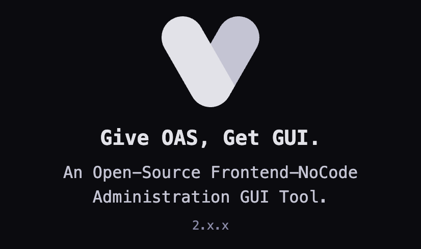

<h2 align="center">OAS-driven Frontend-NoCode Administration Console</h2>

  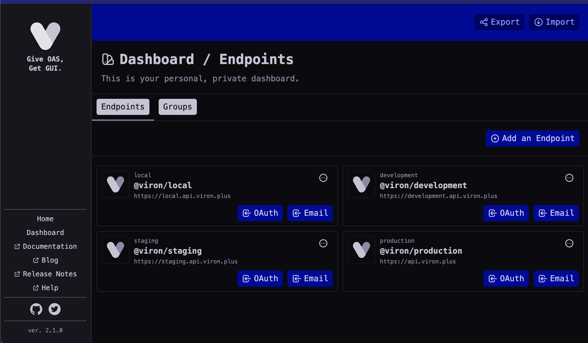
  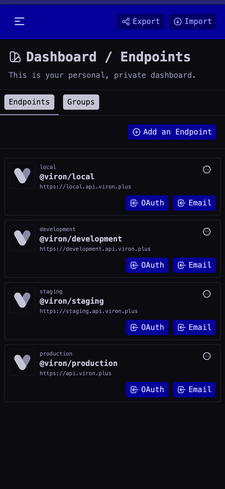

 

  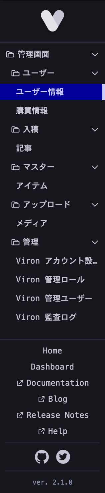
  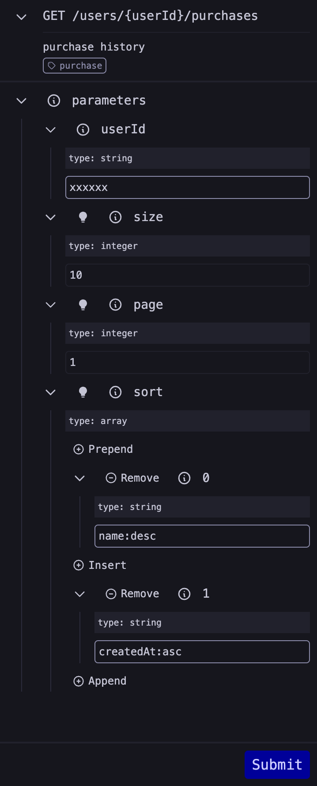
  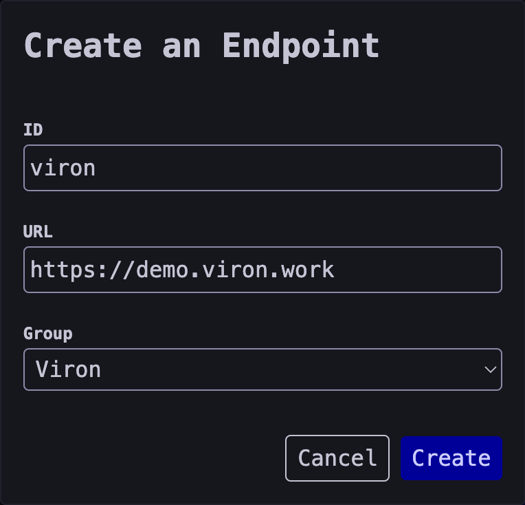

 

  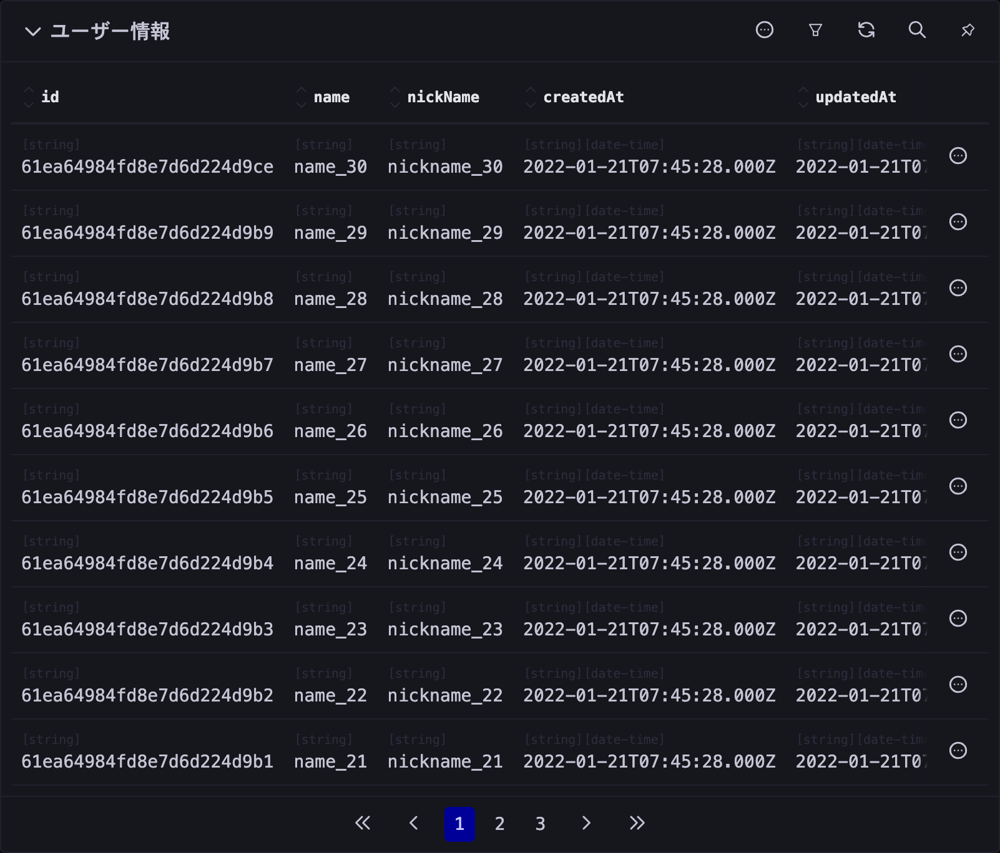

 

  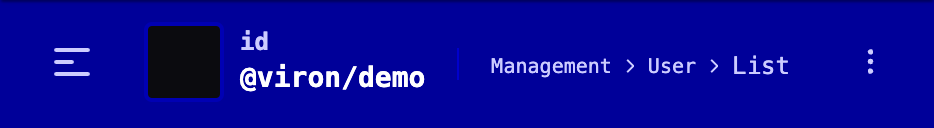
  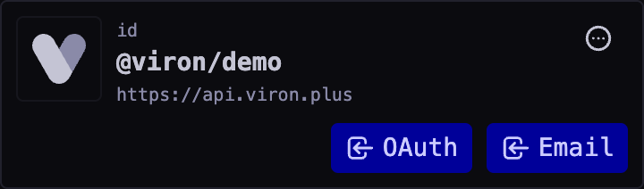
  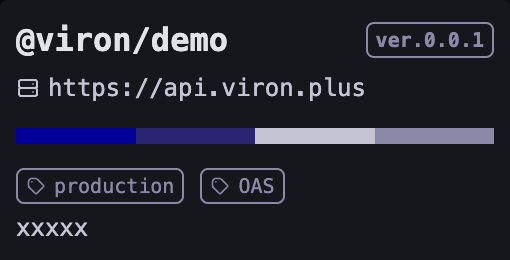

 

  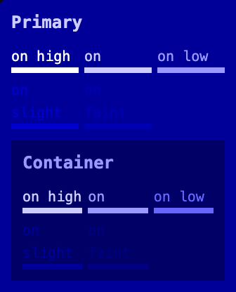
  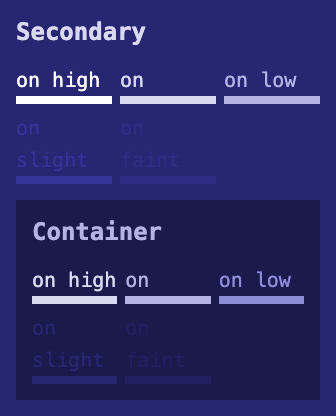
  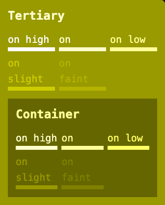
  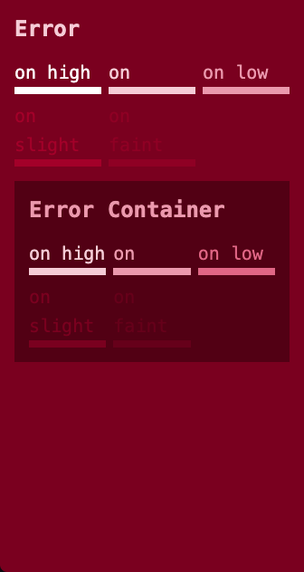
  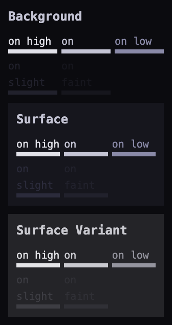

 

  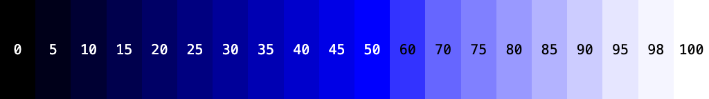
  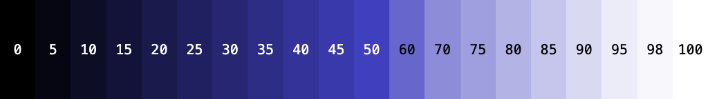
  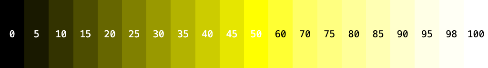
  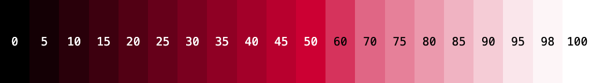
  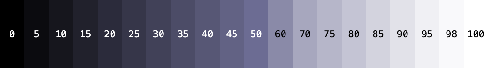
  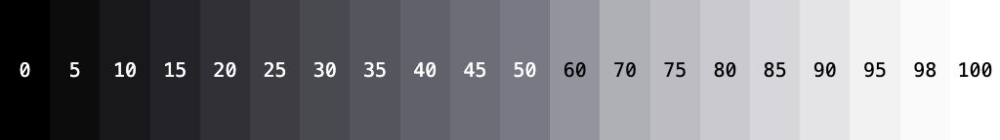

## What is Viron

Viron is a **web-based** administration tool, which

- is based on and leverages **[OpenAPI Specification](https://oai.github.io/Documentation/)**,
- offers **Frontend-Node** console with **fine-tuned GUI**,
- and is an **Open-Source Software**.

Viron enables you to eliminate all the Frontend-matter tasks when administrating your API servers.

## The Idea

OpenAPI Specification, a.k.a. `OAS`, is a `YAML` or `JSON` file that defines an interface to a set of **RESTful** APIs. By interpreting an OAS document, the readers understand things such as:

- The overall idea for the APIs.
- How to call a particular API.
- How to construct request payloads.
- What type of schema do the APIs return.
- The ways to authenticate.
- And much more.

Viron evaluates and leverages OAS documents, interprets those above, and then constructs a **GUI** for you.

## Viron is For Those Who:

- have a `RESTful` administration API server.
- do not have time to make an administration website `from scratch`.
- have good knowledge of OpenAPI Specification.

## Viron is NOT For Those Who:

- require a complex administration website that an OAS document `can not define`.
- have a GraphQL administration API server.

## Code of Conduct

[CODE_OF_CONDUCT.md](./CODE_OF_CONDUCT.md)

## License

[MIT LICENSE](./LICENSE)

## Changelog

[Changelog](https://discovery.viron.plus/docs/References/changelog/)
