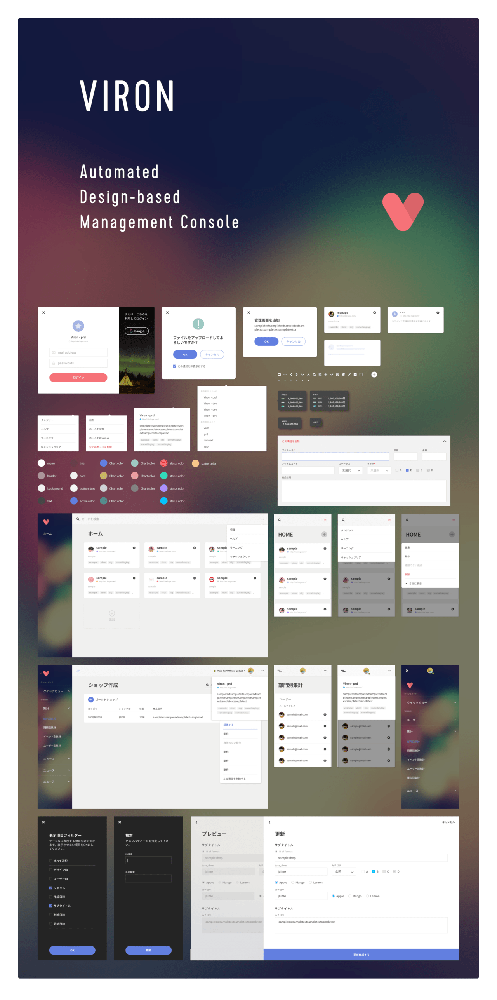

# VIRON

All you do is just create a API server and a OAS2.0 json file. Then viron admin tool is ready to use.
You don't need to write frontend code!

**[Documentation](https://cam-inc.github.io/viron-doc/)**

## Copyright

CA Mobile, Inc. All rights reserved.

## LICENSE

@see : [LICENSE](LICENSE)
