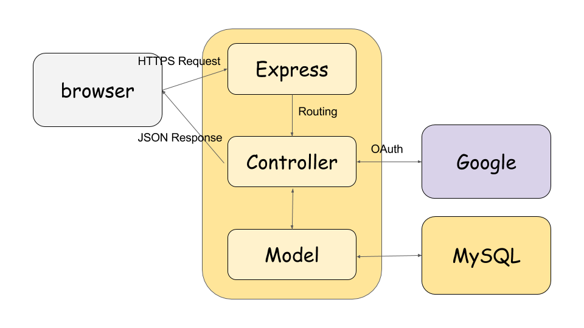

# アーキテクチャ

ここではexample-nodeのアプリケーションアーキテクチャについて記述し、  
ディレクトリ構造を元にそれぞれの役割について説明します。  




### Express

HTTP(S)サーバが受け付けたリクエストをContollerへルーティングします。  
ミドルウェア関数を定義することでアプリケーション(またはルーター）レベルの共通処理を自由に実装できます。  
example-nodeはSwaggerExpressを使用している性質上、ルーターレベルのミドルウェアは定義できません。  

### Controller

各APIのロジックを実行し、レスポンスを返します。  

### Model

データストアを操作するためのインタフェース及びAPIを提供するクラスです。  
example-nodeは [Sequelize](http://docs.sequelizejs.com/) というORMを利用しているため、  
ここではSequelizeのModelを表します。  

### Google

GoogleのOAuth2を利用した認証をサポートしています。  

### MySQL

example-nodeはMySQLの実装のみを提供していますが  
SequelizeはPostgresSQLやMSSQL、SQLiteもサポートしています。  


## ディレクトリ構造

```
.
├── Dockerfile
├── README.md
├── api
│   ├── controllers
│   │   ├── dmc.js
│   │   ├── dmc_admin_role.js
│   │   ├── dmc_admin_user.js
│   │   ├── dmc_audit_log.js
│   │   ├── dmc_auth.js
│   │   ├── dmc_authtype.js
│   │   ├── middlewares.js
│   │   ├── ping.js
│   │   ├── root.js
│   │   ├── swagger.js
│   │   └── user.js
│   ├── fittings
│   │   └── error_handler.js
│   └── swagger
│       └── swagger.yaml
├── app.js
├── config
│   └── default.yaml
├── docker-compose.all.yml
├── docker-compose.db.yml
├── package.json
├── shared
│   ├── config
│   │   ├── index.js
│   │   └── local.js
│   ├── constant.js
│   ├── context.js
│   ├── index.js
│   └── stores
│       ├── index.js
│       └── mysql
└── test
    └── api
        └── controllers
```

### Dockerfile, docker-compose.all.yml, docker-compose.db.yml

ローカル開発環境を提供するためのDocker設定ファイルです。  

### app.js

サーバのエントリポイントです。  
Expressのセットアップを行いサーバを起動します。  

### config/default.yaml

SwaggerExpressの設定ファイルです。  
リクエスト受け付け時のミドルウェア実行をパイプラインで記述しています。  

### api/controllers

APIの実装を行う場所です。  
Expressミドルウェア形式の関数に名前(OperationID)をつけておくことで  
SwaggerExpressがswagger.yamlとのマッピングを行い、ルーティングしています。  

### api/fittings

bagpipes(SwaggerExpressのパイプライン制御を行うライブラリ)の用語で  
一連のステップを制御する機構をpipeと呼ぶのに対して  
単一の機能を提供する機構をfittingと呼んでいるようです。  
example-nodeでは共通エラーハンドラのラッパーを提供しています。  

### api/swagger

swagger.yamlを置く場所です。  
swaggerについては [swagger](swagger.md) で詳しく解説しています。  

### shared

DMCをNode.jsの別アプリと共存させる場合を想定し、  
共通化できそうな機構を切り出した部分です。  

#### shared/config

環境別設定ファイルです。  
JWTの鍵やDataStoreのパスワードを保持することになるため、GitHubにコミットする際には暗号化してください。  
[kms-cryptor.js](https://github.com/cam-inc/kms-cryptor.js)  

#### shared/constant.js

定数を一元管理しているファイルです。  

#### shared/context.js

アプリケーションレベルで共通利用する機能(store,config,loggerなど)を管理する機構です。   
サーバ起動時に必要な初期化処理を行い、  
どこからでも必要な機能を取り出せるようになっています。  

#### shared/stores

RDBのモデル定義などを行う場所です。  
前述の通りexample-nodeではMySQLしか利用していませんが、  
別のRDBやMongoDB/redisといったNoSQLと併用するなども可能です。  

